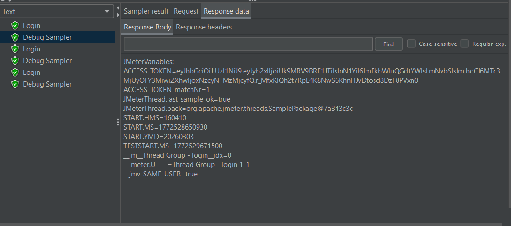
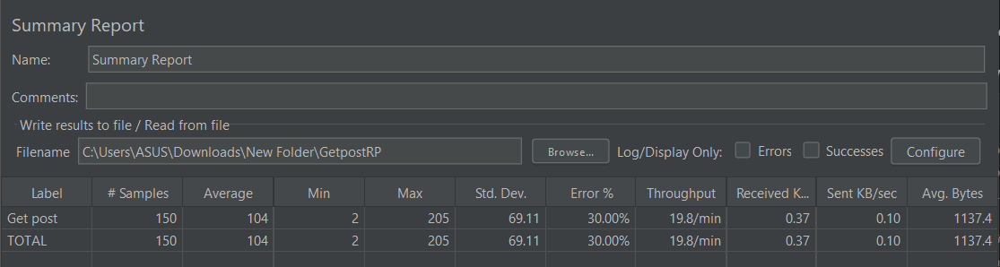
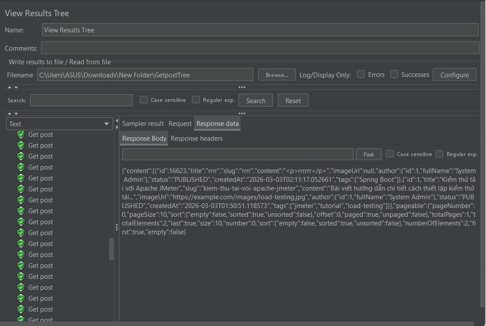
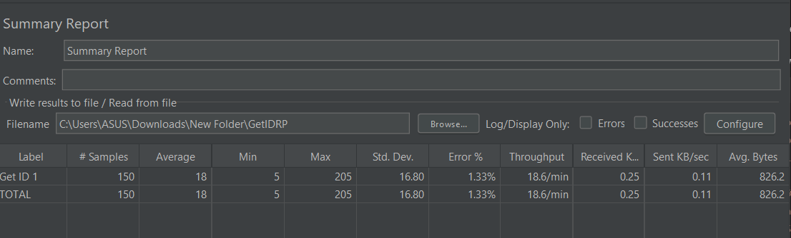
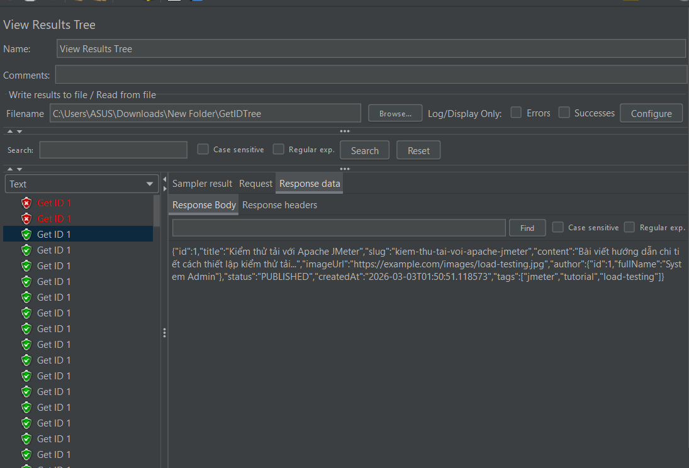
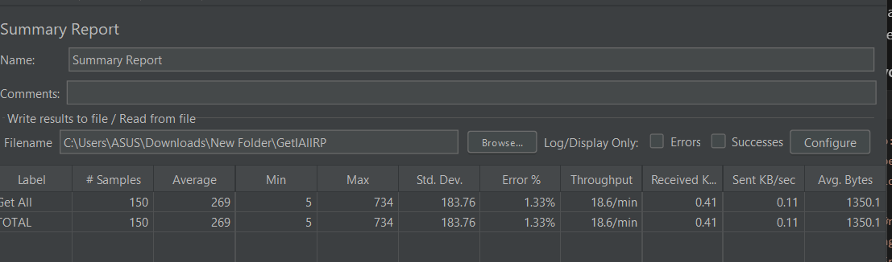
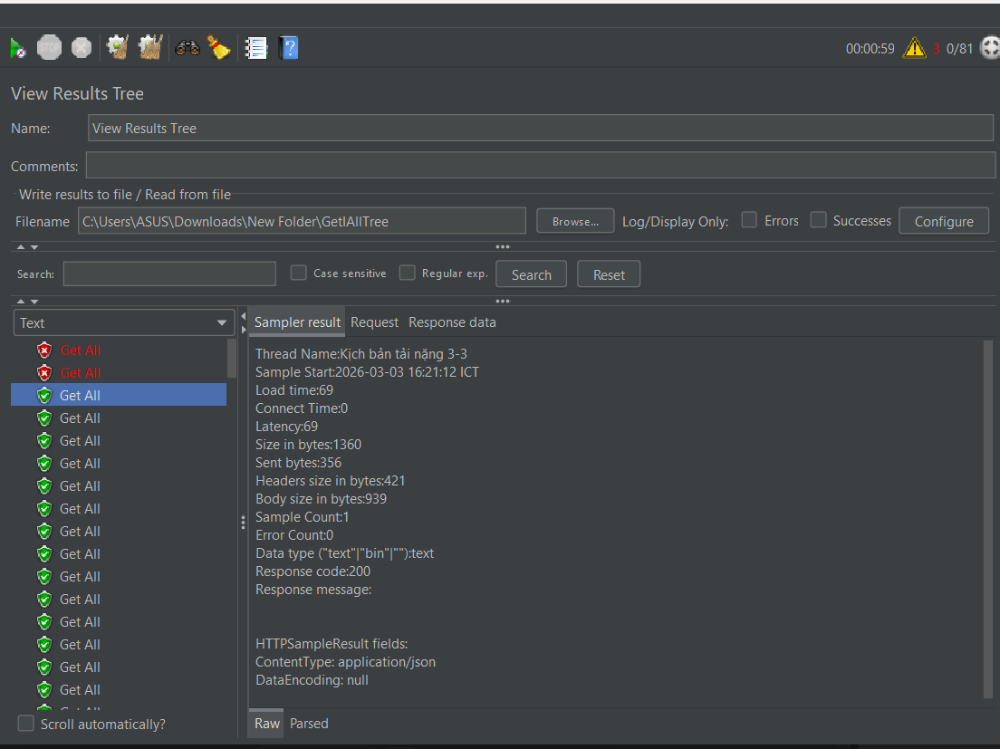
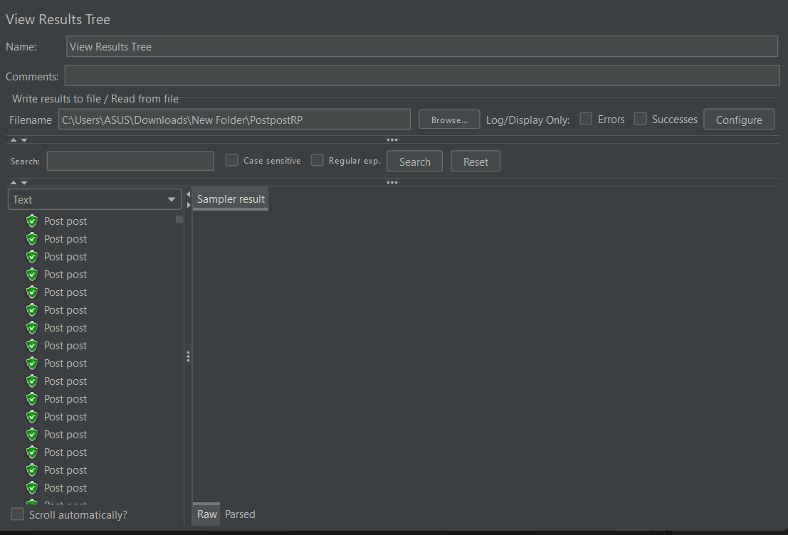
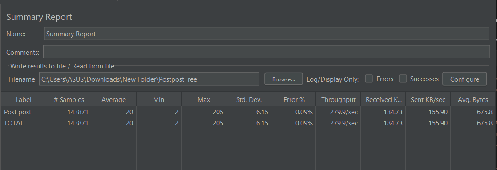
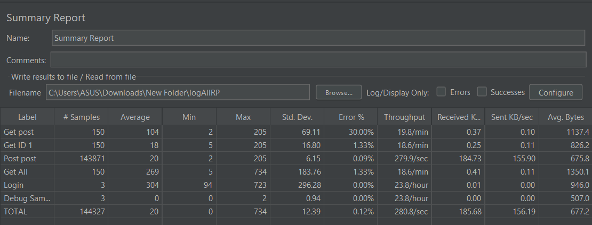

Báo cáo đăng nhập lấy token cho các request API

Thread Group 1: Kịch bản cơ bản

Thread Group 2: Kịch bản tải nặng
-Trường hợp 1: lấy id của 1 sản phẩm

-Trường hợp 2: lấy danh sách tất cả sản phẩm

Thread Group 3: Kịch bản tùy chỉnh

Báo cáo tổng chạy cả 4 Thread Group

Đánh giá qua: Phần lớn đã chạy thành công tất cả các Thread Group nhưng vẫn ở cột ERROR% vẫn có 30% và 1.33% là do Backend khởi động chậm nên các request API không thể thực hiện được